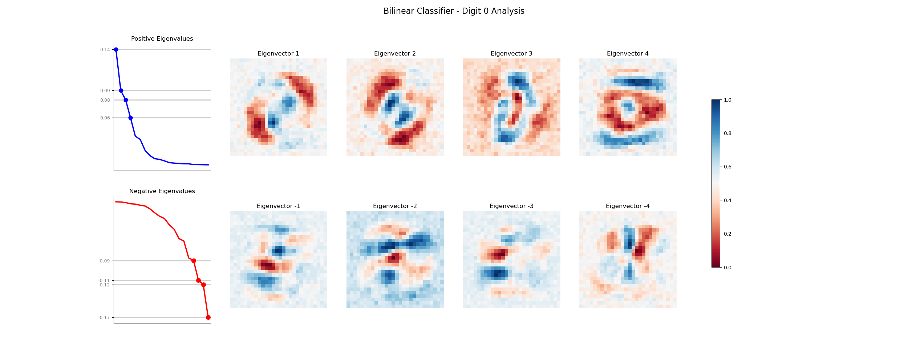
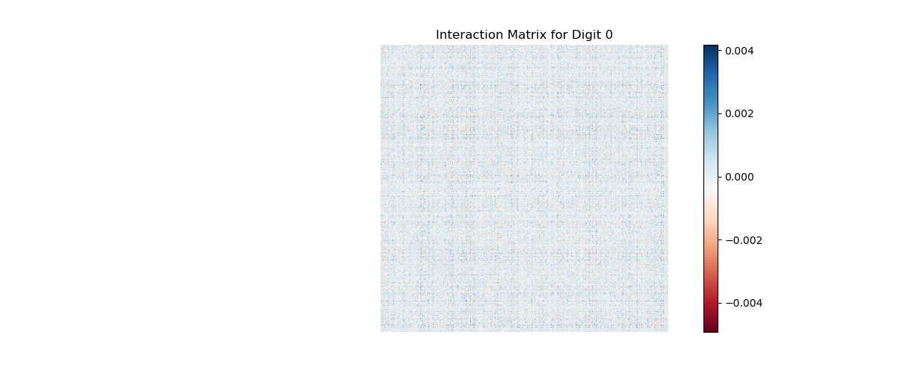
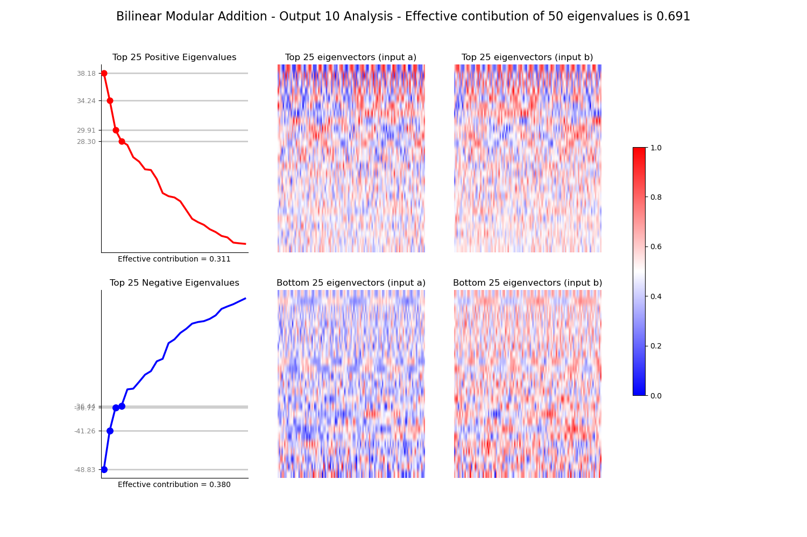
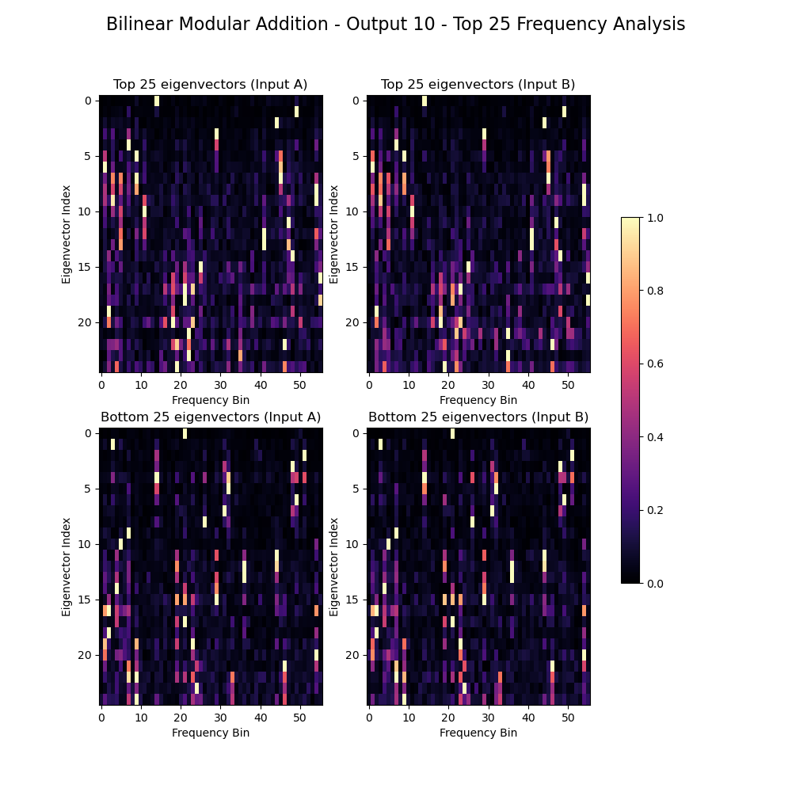
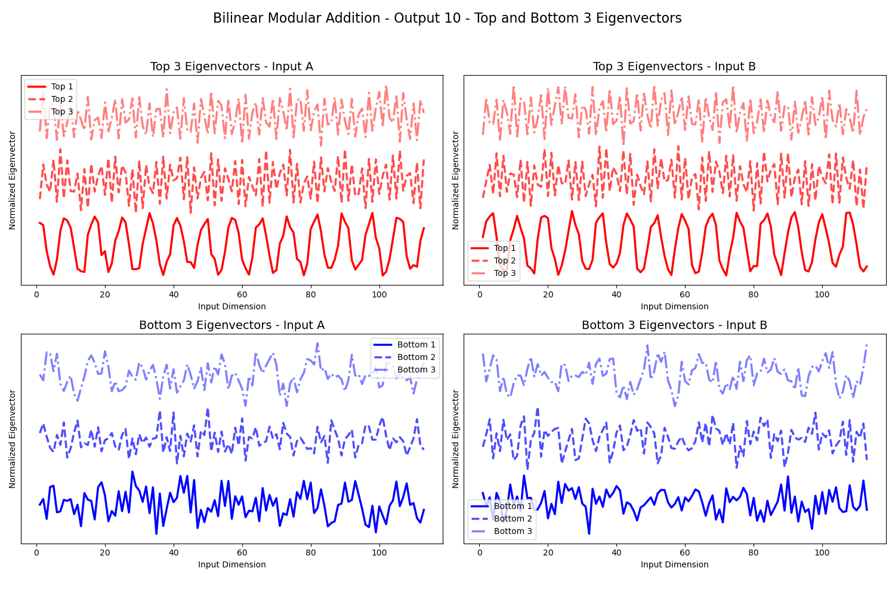

# Bilinear Network Experiments

> **Note**: This README was generated with the assistance of AI to summarize the project structure and findings.

This repository contains implementations and experiments with bilinear neural networks for two main tasks:
1. MNIST Digit Classification
2. Modular Addition Learning

## Project Structure

```
.
├── analysis/          # Analysis scripts for both experiments
├── models/           # Neural network model implementations
├── trainers/         # Training scripts and utilities
├── datasets/         # Dataset loaders and utilities
├── configs/          # Configuration files for different experiments
├── figures/          # Generated visualizations and analysis results
└── checkpoints/      # Saved model checkpoints
```

## MNIST Classification with Bilinear Networks

### Architecture
The MNIST classifier uses a bilinear architecture consisting of:
1. Input layer (784-dimensional flattened MNIST images)
2. Linear embedding layer
3. Bilinear transformation layer
4. Output layer (10 classes)

Key features:
- Input noise regularization during training
- Configurable embedding and hidden dimensions
- Optional bias terms in bilinear layer

### Analysis Tools
The implementation includes tools for analyzing the learned representations:
- Interaction matrix extraction for each digit class
- Eigendecomposition analysis
- Effective rank computation
- Visualization of eigenvectors and eigenvalue distributions

## Modular Addition Learning

A novel application of bilinear networks to learn modular addition operations. The network learns to perform addition in a modular arithmetic system.

### Architecture
- Input: Concatenated pair of numbers (2P-dimensional)
- Bilinear transformation layer
- Output: P-dimensional result in modular space

### Features
- Configurable modulus (P)
- Analysis tools for understanding learned transformations
- Visualization of interaction matrices

## Results

The repository includes extensive visualizations and analysis results in the `figures/` directory:

### MNIST Classification Analysis
Example visualizations for digit "0":


*Analysis of learned representations for digit 0, showing eigenvalue spectrum and key statistics*


*Interaction matrix visualization for digit 0, showing learned bilinear transformations*

### Modular Addition Analysis
Example visualizations for modulo 10:


*Analysis of learned representations for modulo 10 addition*


*Frequency analysis of modulo 10 addition patterns*


*Top and bottom eigenvectors for modulo 10 addition*

The figures directory contains similar analyses for:
- All MNIST digits (0-9)
- Various modular arithmetic bases
- Interaction matrix visualizations
- Eigenvalue spectra

## Usage

### Training Models

For MNIST Classification:
```bash
bash bash_scripts/bilinear_classifier_.sh
```

For Modular Addition:
```bash
bash bash_scripts/bilinear_adder.sh
```

### Running Analysis

```bash
bash bash_scripts/bilinear_analysis.sh
```

## Dependencies

- PyTorch
- NumPy
- Matplotlib (for visualizations)
- Wandb (for experiment tracking)

## Project Status

The repository includes trained models and analysis for both MNIST classification and modular addition tasks. Experiment results are tracked using Weights & Biases (wandb) for reproducibility.

## Implementation Details

### Bilinear Layer
The core component is a bilinear transformation layer that computes:
```python
output[i] = x^T Q[i] x
```
where Q[i] is the interaction matrix for output dimension i.

### Analysis Methods
Both models implement analysis tools including:
- Interaction matrix extraction
- Eigendecomposition analysis
- Effective rank computation
- Visualization utilities
